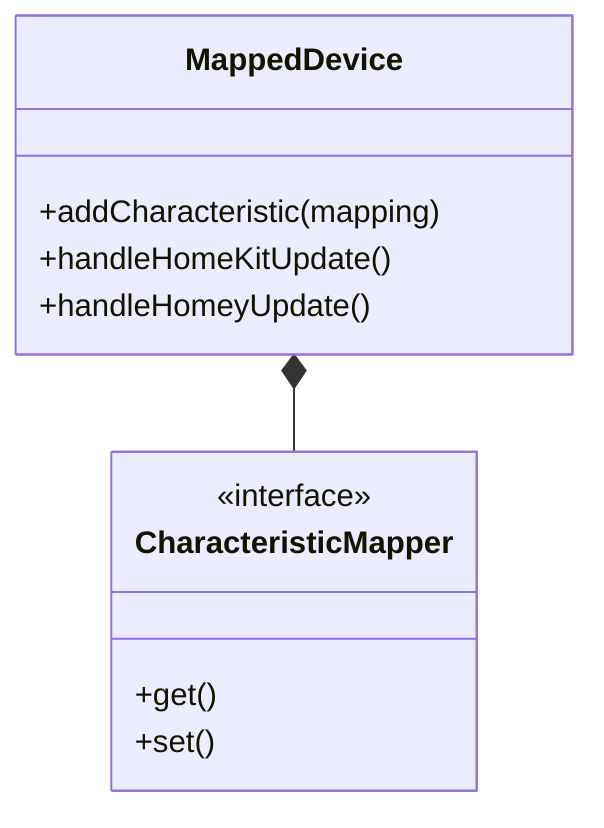

# HomeKit Device Mapping System

## Mapping Architecture


## Core Mapping Pattern
```javascript
// Example from lib/maps/temperature-sensor.js
module.exports = (device, Homey) => ({
    CurrentTemperature: {
        get: (value) => ({
            celsius: Number(value),
            fahrenheit: Number(value) * 1.8 + 32
        }),
        set: (value) => device.setCapabilityValue('measure_temperature', 
            value.unit === 'fahrenheit' ? 
            (value.value - 32) / 1.8 : 
            value.value
        ),
        homeyToHomeKit: {
            capability: 'measure_temperature',
            trigger: 'measure_temperature_changed'
        }
    }
});
```

## Mapping Types
| Category | Mappings | HomeKit Service | Homey Capability |
|----------|----------|-----------------|------------------|
| Sensors | temperature-sensor, humidity-sensor | TemperatureSensor | measure_temperature |
| Security | contact-sensor, motion-sensor | ContactSensor | alarm_motion |
| Controls | light, switch | Lightbulb | onoff |
| Environment | airquality, co2-sensor | AirQualitySensor | measure_co2 |

## Common Conversion Patterns
1. **Unit Conversion**  
   `mapper-accessors.js` provides:
   ```javascript
   celsiusToFahrenheit: (value) => (value * 1.8) + 32
   ```

2. **Value Normalization**  
   ```javascript
   percentageToOnOff: (value) => value > 0 ? true : false
   ```

3. **State Mapping**  
   ```javascript
   lockStateConverter: (value) => ({
       0: 0, // Unsecured
       1: 1  // Secured  
   }[value])