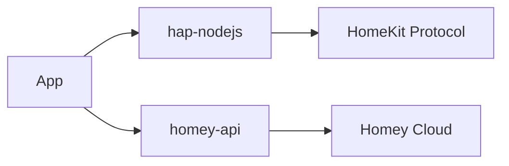

# Module Structure and Dependencies

## Core Modules


### HomeKit Integration (hap-nodejs)
```javascript
// Example from modules/hap-nodejs/index.js
const { Accessory, Service, Characteristic } = require('hap-nodejs');

module.exports = {
  createAccessory: (device) => {
    const accessory = new Accessory(device.name, device.uuid);
    const service = accessory.addService(Service.Lightbulb, device.name);
    
    service.getCharacteristic(Characteristic.On)
      .on('get', callback => callback(null, device.state.onoff))
      .on('set', (value, callback) => {
        device.setCapabilityValue('onoff', value);
        callback();
      });
    
    return accessory;
  }
};
```

### Homey API Abstraction
```javascript
// Example from modules/homey-api/index.js
module.exports = {
  getDevices: async (token) => {
    const response = await fetch('https://api.homey.com/v1/devices', {
      headers: { Authorization: `Bearer ${token}` }
    });
    return response.json();
  },
  
  watchDevice: (deviceId, callback) => {
    const socket = new WebSocket(`wss://api.homey.com/ws/${deviceId}`);
    socket.onmessage = (event) => callback(JSON.parse(event.data));
  }
};
```

## Dependency Graph
```json
{
  "dependencies": {
    "hap-nodejs": "^0.9.4",
    "homey-api": "^2.1.0",
    "vue": "^3.2.0",
    "node-fetch": "^3.3.0"
  },
  "devDependencies": {
    "homey-cli": "^5.0.0",
    "eslint": "^8.0.0"
  }
}
```

## Script Utilities
| Script | Purpose | Usage |
|--------|---------|-------|
| scripts/list-devices.js | Debug device registration | `homey apps run list-devices` |
| scripts/reset-dev.sh | Factory reset helper | `./reset-dev.sh --confirm` |
| scripts/reset-dev.js | Graceful device cleanup | `node reset-dev.js --all` |